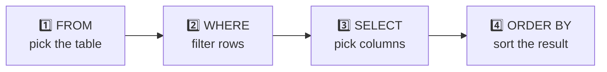
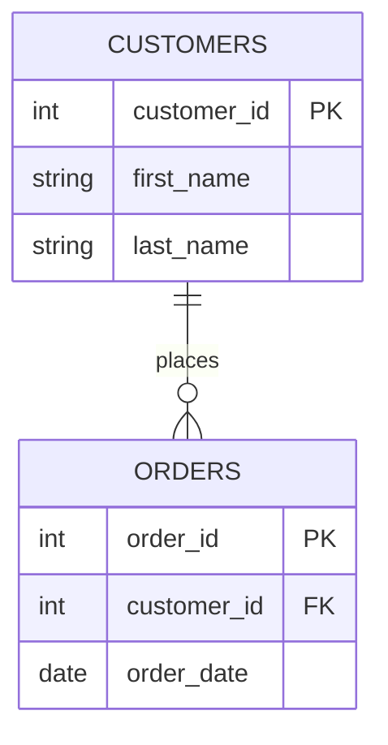

<div align="center">


*Short, practical notes with runnable examples and the gotchas worth remembering.*

</div>

---

## 📑 Table of Contents

| | Topic | | Topic |
|:-:|:--|:-:|:--|
| 1 | [Comments](#1--comments) | 8 | [JOIN with ON](#8--join-with-on) |
| 2 | [Aliases with AS](#2--aliases-with-as) | 9 | [Joining across databases](#9--joining-across-databases) |
| 3 | [SELECT · FROM · WHERE](#3--select--from--where) | 10 | [INNER vs OUTER JOIN](#10--inner-join-vs-outer-join) |
| 4 | [Comparison operators](#4--comparison-operators) | 11 | [Which keyword does what](#11--which-keyword-does-what) |
| 5 | [Logical and special operators](#5--logical-and-special-operators) | 12 | [UNION](#12--union) |
| 6 | [LIKE vs REGEXP](#6--like-vs-regexp) | 13 | [INSERT](#13--insert) |
| 7 | [ORDER BY](#7--order-by) | ★ | [Cheat sheet](#-cheat-sheet) |

> [!NOTE]
> SQL **keywords** are not case sensitive: `select`, `SELECT` and `SeLeCt` all work. The convention is to write keywords in UPPERCASE and names in lowercase so queries are easy to scan. Whether *text values* match case-insensitively depends on the column's collation (in MySQL, the default is case-insensitive).

> [!NOTE]
> The examples use made-up tables (`customers`, `orders`, `products`) and MySQL syntax. `REGEXP` in particular is MySQL-specific.

---

## 🧬 Anatomy of a Query

```sql
SELECT   first_name, points      -- what to show
FROM     customers               -- where it lives
WHERE    points > 1000           -- which rows qualify
ORDER BY points DESC;            -- how to sort the result
```

You *write* the clauses in that order, but the database *thinks* about them in a different one:



---

## 1 · 💬 Comments

Use `--` to comment out a single line. Everything after it is ignored.

```sql
-- This whole line is a comment
SELECT * FROM customers;   -- a comment can also sit at the end of a line
```

> [!TIP]
> In MySQL, `--` must be followed by a space. For multi-line comments, wrap the text in `/* ... */`.

---

## 2 · 🏷️ Aliases with AS

`AS` gives a column (or table) a **temporary new name** in the result. The original column is untouched.

```sql
SELECT
    first_name AS name,
    points * 10 + 100 AS discount_factor
FROM customers;
```

| name | discount_factor |
|:--|--:|
| Ava | 4100 |
| Noah | 1600 |

Aliases are handy for calculated columns, and they are essential for tables in joins (see [topic 8](#8--join-with-on)).

---

## 3 · 🎯 SELECT · FROM · WHERE

| Clause | Job |
|:--|:--|
| `SELECT` | Which **columns** to return |
| `FROM` | Which **table** to read |
| `WHERE` | Which **rows** to keep |

```sql
SELECT *                       -- * means every column
FROM customers
WHERE state = 'CA';

SELECT first_name, last_name   -- or only the ones you need
FROM customers
WHERE points > 1000;
```

---

## 4 · ⚖️ Comparison Operators

These compare two values and are what you use inside `WHERE`.

| Operator | Meaning | Example |
|:-:|:--|:--|
| `>` | greater than | `points > 1000` |
| `>=` | greater than or equal to | `points >= 1000` |
| `<` | less than | `points < 1000` |
| `<=` | less than or equal to | `points <= 1000` |
| `=` | equal to | `state = 'CA'` |
| `!=` | not equal to | `state != 'CA'` |
| `<>` | not equal to (same as `!=`) | `state <> 'CA'` |

> [!NOTE]
> In SQL, a single `=` means **comparison**, not assignment. There is no `==`.

---

## 5 · 🧠 Logical and Special Operators

| Operator | Purpose | Example |
|:--|:--|:--|
| `AND` | both conditions must be true | `points > 500 AND state = 'CA'` |
| `OR` | at least one must be true | `state = 'CA' OR state = 'NY'` |
| `NOT` | reverses a condition | `NOT (points > 1000)` |
| `IN` | matches any value in a list | `state IN ('CA', 'NY', 'TX')` |
| `BETWEEN` | within a range, **inclusive** of both ends | `points BETWEEN 500 AND 1000` |
| `LIKE` | simple pattern match | `last_name LIKE 'b%'` |
| `REGEXP` | regular expression match | `last_name REGEXP '^b'` |
| `IS NULL` | value is missing | `phone IS NULL` |

```sql
-- IN is a cleaner version of chained ORs
SELECT * FROM customers
WHERE state IN ('CA', 'NY', 'TX');

-- Missing values need IS NULL, because = NULL never matches
SELECT * FROM customers WHERE phone IS NULL;
SELECT * FROM customers WHERE phone IS NOT NULL;
```

> [!WARNING]
> **`AND` runs before `OR`.** `a OR b AND c` means `a OR (b AND c)`. When mixing them, use parentheses to say what you mean:
> ```sql
> WHERE (state = 'CA' OR state = 'NY') AND points > 1000
> ```

---

## 6 · 🔍 LIKE vs REGEXP

### `LIKE` uses two wildcards

| Wildcard | Matches | Example | Finds |
|:-:|:--|:--|:--|
| `%` | any number of characters (including none) | `'b%'` | **b**rook, **b**ob |
| `_` | exactly one character | `'_____y'` | any 6-letter value ending in **y** |

### `REGEXP` uses patterns

| Pattern | Meaning | Example | Finds |
|:-:|:--|:--|:--|
| `^` | starts with | `'^field'` | **field**house |
| `$` | ends with | `'field$'` | mac**field** |
| `\|` | OR (logical) | `'field\|mac'` | field **or** mac anywhere |
| `[abcd]` | any one of these characters | `'[gim]e'` | **ge**, **ie**, **me** |
| `[a-f]` | any character in the range | `'[a-h]e'` | **ae** through **he** |
| `.` | any single character | `'b.n'` | **ban**, **bun** |

```sql
-- Last names starting with "brush", ending with "on", or containing "b" followed by r or u
SELECT * FROM customers
WHERE last_name REGEXP '^brush|on$|b[ru]';
```

> [!IMPORTANT]
> **Course takeaway:** prefer `REGEXP` over `LIKE`. One pattern can replace several `LIKE` conditions joined by `OR`, and it is far more expressive.
>
> **Worth knowing:** `LIKE` is standard SQL and works everywhere, while `REGEXP` is MySQL's syntax (other databases spell it differently). For a simple "starts with" check, `LIKE 'b%'` is perfectly fine. Reach for `REGEXP` when the pattern gets complex.

---

## 7 · ↕️ ORDER BY

Sorts the result. The default is ascending (`ASC`). Add `DESC` for descending.

```sql
SELECT first_name, state, points
FROM customers
ORDER BY state DESC, points DESC;   -- sort by state first, then break ties by points
```

| first_name | state | points |
|:--|:-:|--:|
| Mia | TX | 1200 |
| Leo | TX | 800 |
| Ava | CA | 2100 |

> [!TIP]
> You can sort by a column you don't `SELECT`, by an alias, or by a calculated expression. `ORDER BY` always comes **after** `WHERE`.

---

## 8 · 🔗 JOIN with ON

A join combines columns from **two or more tables** by matching rows. `ON` states the matching condition, usually a foreign key equal to a primary key.

```sql
SELECT o.order_id, o.order_date, c.first_name, c.last_name
FROM orders o
JOIN customers c
    ON o.customer_id = c.customer_id;
```



> [!TIP]
> `orders o` and `customers c` are **table aliases**. They shorten the query, and they are required when the same column name exists in both tables (`customer_id` here). Without the prefix, SQL can't tell which one you mean.

---

## 9 · 🗄️ Joining Across Databases

To use a table from a database you are **not currently connected to**, prefix the table name with its database name.

```sql
-- Connected to store_db, but we also need a table from inventory_db
SELECT *
FROM order_items oi
JOIN inventory_db.products p        -- database_name.table_name
    ON oi.product_id = p.product_id;
```

Tables in the *current* database need no prefix. Only the "foreign" ones do.

---

## 10 · 🔀 INNER JOIN vs OUTER JOIN

Take two tables, **A** (left) and **B** (right).

| Join | Returns |
|:--|:--|
| **INNER JOIN** | only rows that have a **match in both** tables |
| **LEFT JOIN** | **all rows from A**, plus matches from B (`NULL` where B has none) |
| **RIGHT JOIN** | **all rows from B**, plus matches from A (`NULL` where A has none) |

```text
   INNER JOIN            LEFT JOIN             RIGHT JOIN

  ┌───┬───┬───┐         ┌───┬───┬───┐         ┌───┬───┬───┐
  │ A │ ▓ │ B │         │ ▓ │ ▓ │ B │         │ A │ ▓ │ ▓ │
  └───┴───┴───┘         └───┴───┴───┘         └───┴───┴───┘
  only the overlap      all of A + overlap    overlap + all of B
```

**Example:** list every customer, including those who have never ordered.

```sql
SELECT c.customer_id, c.first_name, o.order_id
FROM customers c
LEFT JOIN orders o
    ON c.customer_id = o.customer_id
ORDER BY c.customer_id;
```

| customer_id | first_name | order_id |
|:-:|:--|:-:|
| 1 | Ava | 101 |
| 2 | Noah | `NULL` ← no orders yet |
| 3 | Mia | 102 |

An `INNER JOIN` would have silently dropped Noah. A `LEFT JOIN` keeps him.

---

## 11 · 🔑 Which Keyword Does What

| You write | You get |
|:--|:--|
| `JOIN` | an **INNER** join (`INNER` is optional) |
| `LEFT JOIN` | an **OUTER** join, keeping everything from the left table |
| `RIGHT JOIN` | an **OUTER** join, keeping everything from the right table |

```sql
-- These two are identical
SELECT * FROM orders JOIN customers ON ...;
SELECT * FROM orders INNER JOIN customers ON ...;

-- OUTER is optional here too
SELECT * FROM orders LEFT JOIN customers ON ...;
SELECT * FROM orders LEFT OUTER JOIN customers ON ...;
```

> [!TIP]
> Prefer `LEFT JOIN` over `RIGHT JOIN`. Reading left to right, "keep everything from the table I started with" is easier to follow, and you can always swap the table order to avoid a `RIGHT JOIN`.

---

## 12 · ➕ UNION

`JOIN` adds **columns** side by side. `UNION` stacks **rows** from separate queries on top of each other.

```sql
SELECT customer_id, first_name, 'Gold' AS tier
FROM customers
WHERE points >= 3000

UNION

SELECT customer_id, first_name, 'Silver' AS tier
FROM customers
WHERE points < 3000;
```

```text
   Query 1 rows
 ┌─────────────┐
 │ Ava   Gold  │
 │ Mia   Gold  │          ┌─────────────┐
 └─────────────┘   ───►   │ Ava   Gold  │
   Query 2 rows           │ Mia   Gold  │
 ┌─────────────┐          │ Noah  Silver│
 │ Noah  Silver│          └─────────────┘
 └─────────────┘
```

**Rules**

- Every query must return the **same number of columns**.
- Column **names come from the first query**.
- `UNION` removes duplicate rows. Use `UNION ALL` to keep them (and it's faster).

---

## 13 · ➕ INSERT

`INSERT` adds new rows to a table.

```sql
-- One row, naming the columns (the safest form)
INSERT INTO customers (first_name, last_name, state, points)
VALUES ('Ava', 'Stone', 'CA', 0);

-- Several rows in one statement
INSERT INTO customers (first_name, last_name, state, points)
VALUES
    ('Noah', 'Reed', 'NY', 120),
    ('Mia',  'Cole', 'TX', 450);
```

> [!TIP]
> - Always list the column names. The query keeps working if the table gains a column later.
> - Skip auto-increment columns (like `customer_id`). The database fills them in.
> - Columns with a default value, or that allow `NULL`, can be left out.

---

## ⚡ Cheat Sheet

```sql
-- comment
SELECT col1, col2 AS alias          -- columns (rename with AS)
FROM table1 t1                      -- table (alias optional)
JOIN table2 t2 ON t1.id = t2.t1_id  -- INNER JOIN
LEFT JOIN table3 t3 ON ...          -- keep all rows from the left
WHERE a > 5
  AND (b IN ('x', 'y') OR c BETWEEN 1 AND 10)
  AND d REGEXP '^abc'
  AND e IS NULL
ORDER BY col1 DESC, col2;           -- sort

-- stack results
SELECT ... UNION SELECT ...;

-- add data
INSERT INTO table1 (col1, col2) VALUES (1, 'a'), (2, 'b');
```

| Need | Use |
|:--|:--|
| Rename a column | `AS` |
| Filter rows | `WHERE` |
| Match one of many values | `IN` |
| Match a range (inclusive) | `BETWEEN` |
| Find missing values | `IS NULL` |
| Complex text pattern | `REGEXP` |
| Sort | `ORDER BY ... ASC/DESC` |
| Combine columns from tables | `JOIN ... ON` |
| Keep unmatched rows | `LEFT JOIN` / `RIGHT JOIN` |
| Stack rows from queries | `UNION` |
| Add rows | `INSERT INTO ... VALUES` |

---

<div align="center">

**Keep querying. Keep learning.** 🚀


</div>
