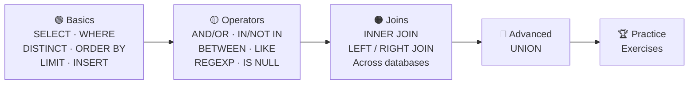
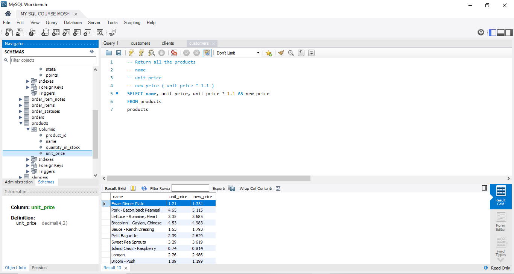

<div align="center">


<a href="https://git.io/typing-svg">
  
</a>

<br/>


**A complete, beginner-friendly SQL learning kit: examples, exercises, a cheat sheet and visual explanations.**
*Perfect for students, developers, and anyone preparing for interviews.*

<br/>

**[✨ Features](#-features)** &nbsp;•&nbsp;
**[🗺️ Learning Path](#️-learning-path)** &nbsp;•&nbsp;
**[📚 Topics](#-topics-covered)** &nbsp;•&nbsp;
**[🧩 Exercises](#-exercises)** &nbsp;•&nbsp;
**[📘 Cheat Sheet](#-sql-cheat-sheet)** &nbsp;•&nbsp;
**[🚀 Get Started](#-how-to-use)**

</div>

---

## ✨ Features

| | |
|:-:|:--|
| 🖼️ | **Visual examples** for every SQL concept |
| 🌱 | **Beginner to intermediate** coverage |
| 🔗 | Includes **JOINs, WHERE, LIKE, REGEXP, UNION** and more |
| 🧩 | **Exercises** to practice what you learn |
| 📘 | **SQL Cheat Sheet (PDF)** for quick revision |
| 🎓 | Ideal for **self-study** or **teaching material** |

---

## 🗺️ Learning Path

Follow the topics in this order. Each step builds on the one before it.



> 💡 `content.txt` in this repo lays out the same structured path, so you can follow it step by step.

---

## 📚 Topics Covered

Open any topic to see its visual example.

### 🔹 Basic SQL

<details>
<summary><b>SELECT</b> &nbsp;·&nbsp; choose which columns to return</summary>
<br/>
<div align="center">
  
</div>
</details>

<details>
<summary><b>WHERE</b> &nbsp;·&nbsp; filter rows by a condition</summary>
<br/>
<div align="center">
  
</div>
</details>

<details>
<summary><b>DISTINCT</b> &nbsp;·&nbsp; remove duplicate values from the result</summary>
<br/>
<div align="center">
  
</div>
</details>

<details>
<summary><b>ORDER BY</b> &nbsp;·&nbsp; sort the result ascending or descending</summary>
<br/>
<div align="center">
  
</div>
</details>

<details>
<summary><b>LIMIT</b> &nbsp;·&nbsp; restrict how many rows come back</summary>
<br/>
<div align="center">
  
</div>
</details>

<details>
<summary><b>INSERT</b> &nbsp;·&nbsp; add new rows to a table</summary>
<br/>
<div align="center">
  
</div>
</details>

### 🔹 Operators

<details>
<summary><b>AND / OR</b> &nbsp;·&nbsp; combine multiple conditions</summary>
<br/>
<div align="center">
  
</div>
</details>

<details>
<summary><b>NOT / IN</b> &nbsp;·&nbsp; negate a condition, or match against a list</summary>
<br/>
<div align="center">
  
</div>
</details>

<details>
<summary><b>BETWEEN</b> &nbsp;·&nbsp; match values within a range</summary>
<br/>
<div align="center">
  
</div>
</details>

<details>
<summary><b>LIKE</b> &nbsp;·&nbsp; simple pattern matching</summary>
<br/>
<div align="center">
  
</div>
</details>

<details>
<summary><b>REGEXP</b> &nbsp;·&nbsp; powerful regular-expression matching</summary>
<br/>
<div align="center">
  
</div>
</details>

<details>
<summary><b>IS NULL</b> &nbsp;·&nbsp; find missing values</summary>
<br/>
<div align="center">
  
</div>
</details>

### 🔹 Joins

<details>
<summary><b>JOIN</b> &nbsp;·&nbsp; combine columns from multiple tables with ON</summary>
<br/>
<div align="center">
  
</div>
</details>

<details>
<summary><b>JOIN across databases</b> &nbsp;·&nbsp; use tables from another database</summary>
<br/>
<div align="center">
  
</div>
</details>

<details>
<summary><b>OUTER JOIN</b> &nbsp;·&nbsp; LEFT and RIGHT JOIN keep unmatched rows</summary>
<br/>
<div align="center">
  
</div>
</details>

### 🔹 Advanced

<details>
<summary><b>UNION</b> &nbsp;·&nbsp; stack the rows of multiple queries</summary>
<br/>
<div align="center">
  
</div>
</details>

---

## 🧩 Exercises

Put your knowledge to work. The exercises cover:

| 🔹 | 🔹 | 🔹 |
|:--|:--|:--|
| ✍️ Query writing | 🎯 Filtering | 🔗 Joins |
| 🔍 Pattern matching | ⚙️ Conditions | 🧠 Logical operators |

<table>
<tr>
<td align="center" width="50%">
  <b>Exercise 1</b><br/><br/>
  
</td>
<td align="center" width="50%">
  <b>Exercise 2</b><br/><br/>
  
</td>
</tr>
</table>

> 💡 Try each one on your own before checking the solution.

---

## 📘 SQL Cheat Sheet

A complete quick-reference sheet is included in the repository.

<div align="center">

### [📥 Open `SQL-Cheat-Sheet.pdf`](./SQL-Cheat-Sheet.pdf)

*Perfect for last-minute revision before an interview or exam.*

</div>

---

## 📂 Repository Structure

```text
SQL-Course-Materials/
│
├── 🔹 Basics
│   ├── SELECT EXAMPLE.PNG
│   ├── WHERE EXAMPLE.PNG
│   ├── DISTINCT EXAMPLE.PNG
│   ├── INSERT EXAMPLE.PNG
│   ├── ORDER BY EXAMPLE.PNG
│   └── LIMIT EXAMPLE.PNG
│
├── 🔹 Operators
│   ├── LIKE OPERATOR.PNG
│   ├── REGEXP OPERATOR.PNG
│   ├── AND & OR OPERATORS.PNG
│   ├── NOT & IN OPERATORS.PNG
│   ├── BETWEEN OPERATOR.PNG
│   └── IS NULL OPERATOR.PNG
│
├── 🔹 Joins
│   ├── JOIN EXAMPLE.PNG
│   ├── JOIN ACROSS DATABASES.PNG
│   └── OUTER JOIN WITH LEFT OR RIGHT JOIN KEYWORD.PNG
│
├── 🔹 Advanced
│   └── UNION EXAMPLE.PNG
│
├── 🧩 Exercises
│   ├── EXERCISE.PNG
│   └── EXERCISE 2.PNG
│
├── 📘 SQL-Cheat-Sheet.pdf
└── 📝 content.txt
```

---

## 🚀 How to Use

```bash
git clone https://github.com/Manu577228/SQL-Course-Materials.git
cd SQL-Course-Materials
```

| Step | What to do |
|:-:|:--|
| **1** | Open the image files to learn each SQL concept visually |
| **2** | Follow `content.txt` for the structured learning path |
| **3** | Revise with the cheat sheet |
| **4** | Test yourself with the exercises |

---

## 🏆 Ideal For

<table>
<tr>
<td align="center" width="20%">🎓<br/><b>Students</b><br/>learning SQL</td>
<td align="center" width="20%">💻<br/><b>Developers</b><br/>refining querying skills</td>
<td align="center" width="20%">📊<br/><b>Data analysts</b><br/>and beginners</td>
<td align="center" width="20%">🎯<br/><b>Interview</b><br/>preparation</td>
<td align="center" width="20%">👨‍🏫<br/><b>Trainers</b><br/>teaching SQL</td>
</tr>
</table>

---

## ⭐ Support

If this repository helped you, please **star the repo**. It helps more learners find it.

<div align="center">

<a href="https://star-history.com/#Manu577228/SQL-Course-Materials&Date">
  
</a>

</div>

---

## 📬 Connect

<div align="center">

<a href="https://github.com/Manu577228">
  
</a>
<a href="https://youtube.com/@code-with-Bharadwaj">
  
</a>

<br/><br/>

**Happy Querying! 🚀**


</div>
